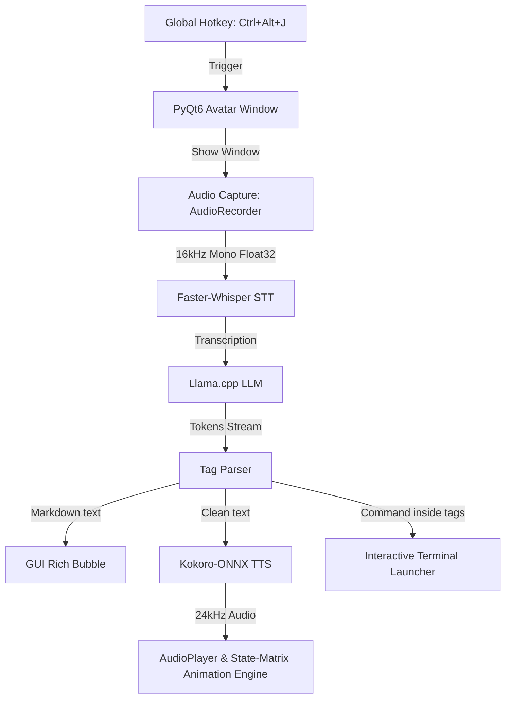

# Llama Assistant

[](#)
[](#)
[](#)
[](#)

Llama Assistant is a professional, lightweight, and local desktop virtual assistant for Linux (optimized for KDE Plasma/Wayland). Represented by an avatar with dynamic Lip-Sync, the assistant runs completely offline using state-of-the-art local AI models: Faster-Whisper for Speech-to-Text (STT), Llama.cpp for Large Language Model (LLM) streaming, and Kokoro-ONNX for Text-to-Speech (TTS) synthesis.

https://github.com/user-attachments/assets/db1c1cde-3cbc-4059-813c-4da56e9e704c

---

## Key Features

*   **Local and Private**: No cloud calls. All models run locally on your CPU or Nvidia GPU.
*   **Walkie-Talkie Style Hold-to-Talk**: Trigger listening by holding the global shortcut `Ctrl + Alt + J`. Release to process and listen.
*   **Background Daemon Mode**: Runs silently in the system background. The avatar window automatically pops up when the hotkey is held, animates while talking, and disappears (`self.hide()`) after 10 seconds of inactivity.
*   **Wayland and KDE Plasma Compatibility**: Programmatically forces the `xcb` QPA platform to run under XWayland, allowing absolute window quadrant positioning and seamless transparent background overlays.
*   **Interactive Terminal Execution**: If the LLM generates a command (e.g., inside `<cmd>df -h</cmd>` tags), a new terminal emulator window (supporting Konsole, GNOME Terminal, and xterm) automatically opens with the command prefilled in the Bash input buffer using `read -e -i`. It does not execute automatically, leaving the user in control to edit, confirm with `Enter`, or cancel with `Ctrl+C`.
*   **Dynamic State-Matrix Animation**: The avatar uses a state matrix intersecting mouth state (`open`/`closed`) and eye state (`open`/`closed`) using preloaded assets (`quiet.png`, `cm-ce.png`, `om-oe.png`, `om-ce.png`, `listen.png`). Mouth movements are dynamically synchronized with speech tokens (bilabials and spacing close the mouth; vowels and other consonants open it).
*   **Liveness Blinking Loop**: An independent background loop triggers natural random blinks (closing eyes for 150ms every 2.5 to 5.5 seconds) while the assistant is thinking or speaking, while remaining static and stable when idle (`quiet`) or listening.
*   **Text and Speech Support**: In addition to voice capture, you can hit `Ctrl + Alt + K` to open a sleek floating window and input your prompt via text.
*   **Markdown and Emoji GUI**: The avatar's speech bubble parses and renders rich text formatting (bold, italics, static emojis) natively in real-time during streaming. Emojis and special characters are stripped from the audio input to prevent Kokoro TTS from stuttering, while remaining fully visible in the chat bubble.
*   **Advanced Control Panel**: An independent launcher (`configure.py`) lets you manage hardware options, select microphone/speaker device stable names, customize system prompts, define custom LLM context windows (`n_ctx`), toggle Nvidia CUDA acceleration, and select English/Spanish voices.

---

## System Architecture



---

## Requirements and Installation

### 1. System Dependencies (Linux)

You need standard development headers, PortAudio (for Python `sounddevice`), and a terminal emulator installed. For KDE Plasma:

```bash
# Ubuntu/Debian
sudo apt install python3-dev portaudio19-dev libasound2-dev konsole

# Arch Linux
sudo pacman -S portaudio alsa-lib konsole
```

### 2. Python Virtual Environment Setup

Create and activate a virtual environment in the project directory:

```bash
cd /path/to/Llama-assistant
python3 -m venv .venv
source .venv/bin/activate
```

Install packages (ensure CUDA support for `llama-cpp-python` if using a GPU):

```bash
pip install -r requirements.txt
```
*(Dependencies include: `PyQt6`, `sounddevice`, `numpy`, `faster-whisper`, `llama-cpp-python`, `kokoro-onnx`, and `pynput`)*.

---

## Models File Structure

The project relies on local model weights placed in the folder structure. By default, setup expects:

1.  **Llama.cpp GGUF Model**: Place any instruct/chat model (e.g., Qwen-2.5-2B, Gemma-3-4B) in the project directory.
2.  **Kokoro TTS weights**: Place `kokoro-v1.0.onnx` and `voices-v1.0.bin` in a directory named `kokoro-v1.0/` inside the project root.

---

## Running the Assistant

### 1. Launching the Configuration Panel

Run the utility panel to configure paths, audio devices, and preferences without loading heavy AI models into RAM/VRAM:

```bash
.venv/bin/python configure.py
```

### 2. Running the Assistant

Start the assistant in background daemon mode:

```bash
.venv/bin/python main.py
```

*   **Startup**: A temporary window shows `Cargando...` (Loading) to indicate loading status. Once ready, it shows `Listo (Manten Ctrl + Alt + J)` (Ready (Hold Ctrl + Alt + J)) and hides itself automatically after 10 seconds of inactivity.
*   **Voice Interaction**: Press and hold `Ctrl + Alt + J` to make the avatar appear in listening mode. Release the keys to start thinking and speaking.
*   **Text Interaction**: Press `Ctrl + Alt + K` to display the prompt input window.
*   **Right-Click Menu**: Right-click on the devil avatar to open the context menu and select **Configuración** (Settings) or **Salir** (Exit).

### 3. Desktop Application Shortcut

A Linux desktop shortcut is located at `~/.local/share/applications/llama-assistant.desktop`. It triggers the `llama-assistant` global command, automatically launching the script inside the correct working directory (`Path=/path/to/Llama-assistant`).

---

## Interactive Shell Integration

The assistant uses the `<cmd>...</cmd>` syntax in the system prompt. When asking the assistant to run terminal commands:

1.  The model streams: *"I've loaded the storage info command: `<cmd>df -h</cmd>`"*
2.  The text bubble formats it as a Markdown inline code block: `df -h`.
3.  The speech engine speaks the text but silences the code part.
4.  Immediately upon text completion, a new terminal (`konsole`) opens with the command pre-typed:
    ```text
    Ejecutar comando? (Enter para confirmar, Ctrl+C para cancelar): df -h
    ```
5.  You can review, modify, press **Enter** to run, or press **Ctrl+C** to abort, leaving you in a standard, active terminal session.
